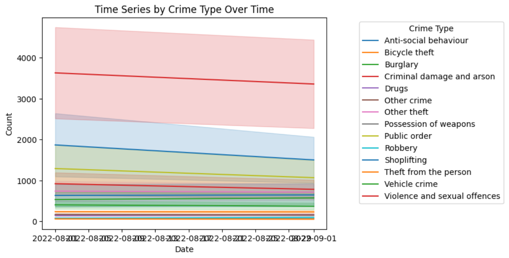

<div align="center">

# 🚔 UK Crime Data Analysis & Prediction

### End-to-End Data Analytics & Machine Learning Project

Analyzing UK Police crime data using Python, Geospatial Analysis, Machine Learning, and Deep Learning.


</div>

---

# 📌 Overview

This project explores crime patterns across the United Kingdom using publicly available UK Police datasets.

The project follows a complete Data Science workflow:

- Data Collection
- Data Cleaning
- Exploratory Data Analysis (EDA)
- Geospatial Visualization
- Time Series Analysis
- Machine Learning
- Deep Learning
- Model Evaluation

The objective is to discover meaningful crime trends and build predictive models using historical crime data.

---

## 📷 Project Preview

### Time Series Analysis



### Cumulative Crime Analysis


### Crime type Histogram


---

# 🚀 Features

✔ Crime Data Cleaning

✔ Exploratory Data Analysis

✔ Interactive Plotly Visualizations

✔ Geospatial Crime Mapping

✔ Crime Trend Analysis

✔ Stop & Search Analysis

✔ Machine Learning Classification

✔ Deep Learning using LSTM

✔ Model Evaluation

---

# 📂 Dataset

Data obtained from:

- UK Police Data
- Monthly Crime Reports
- Stop & Search Data
- UK District Shapefiles

---

# 🛠 Technologies

| Category | Tools |
|----------|-------|
| Language | Python |
| Data Analysis | Pandas, NumPy |
| Visualization | Matplotlib, Seaborn, Plotly |
| GIS | GeoPandas |
| Machine Learning | Scikit-Learn |
| Deep Learning | TensorFlow/Keras |
| Time Series | Statsmodels, pmdarima |

---

# 📊 Workflow

```text
Collect Data
      │
      ▼
Clean Dataset
      │
      ▼
EDA
      │
      ▼
Visualization
      │
      ▼
Feature Engineering
      │
      ▼
Machine Learning
      │
      ▼
Deep Learning
      │
      ▼
Model Evaluation
```

---

# 📈 Exploratory Data Analysis

The notebook investigates:

- Crime type frequency
- Monthly crime trends
- Geographic crime hotspots
- Crime outcome analysis
- Stop & Search demographics
- Police force comparison

Visualizations include:

- Histograms
- Heatmaps
- Interactive Charts
- Pie Charts
- Maps
- Time Series Graphs

---

# 🤖 Machine Learning

Implemented models include:

- Random Forest
- Support Vector Machine (SVM)
- K-Nearest Neighbors (KNN)

Evaluation Metrics:

- Accuracy
- Precision
- Recall
- F1-score

---

# 🧠 Deep Learning

The project also explores:

- LSTM Networks
- Sequential Modeling
- Crime Outcome Prediction

---

# 📊 Results

The analysis identifies:

- Crime hotspots across UK districts.
- Temporal crime trends.
- Most common crime categories.
- Demographic patterns in stop-and-search records.
- Predictive performance of traditional ML models and LSTM.

---

# 📁 Repository Structure

```
UK-Crime-Analysis
│
├── README.md
├── requirements.txt
├── UK_Crime_dataset.ipynb
├── data/
├── images/
│   ├── dashboard.png
│   ├── heatmap.png
│   └── crime_map.png
└── outputs/
```

---

# ⚙ Installation

```bash
git clone https://github.com/<Shumaila1987/Crime-Prediction-Using-Machine-Learning>.git

cd Crime-Prediction-Using -Machine-Learning

pip install -r requirements.txt
```

---

# ▶ Running the Notebook

```bash
jupyter notebook
```

Open:

```
UK_Crime_dataset.ipynb
```

---

# 🔮 Future Improvements

- Real-time crime prediction
- Interactive Streamlit Dashboard
- Transformer-based forecasting
- Automated ETL pipeline
- Hyperparameter optimization

---

# 👤 Author

**Shumaila Liaqat**

Data Analytics | Machine Learning | Python

GitHub: https://github.com/Shumaila1987

LinkedIn: https://linkedin.com/in/Shumaila1987

---

# ⭐ If you found this project useful, consider giving it a star!


